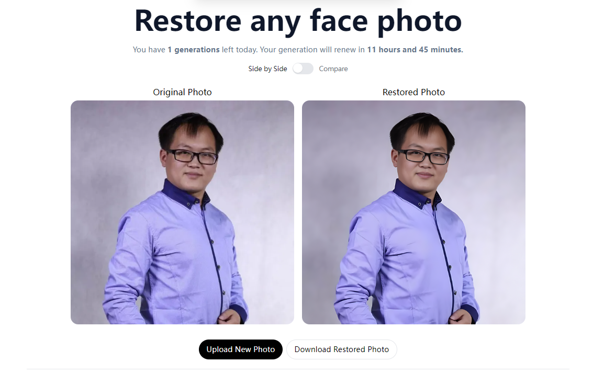

# [photo.55ai.store](https://photo.55ai.store/)

This project restores old face photos using AI. 

[](https://photo.55ai.store/)

## How it works

It uses an ML model from the Applied Research Center called [GFPGAN](https://github.com/TencentARC/GFPGAN) on [Replicate](https://replicate.com/) to restore face photos. This application gives you the ability to upload any photo, which will send it through this ML Model using a Next.js API route, and return your restored photo.

## Running Locally

Note: I just added auth so these steps are not complete as of now. You can git clone from [this specific commit](https://github.com/liuming9157/restore-photos/tree/1c5c8ac4f52a08f68a3091d3b21be8a65aef71f2).

### Cloning the repository the local machine.

```bash
git clone https://github.com/liuming9157/restore-photos.git
```

### Creating a account on Replicate to get an API key.

1. Go to [Replicate](https://replicate.com/) to make an account.
2. Click on your profile picture in the top right corner, and click on "Dashboard".
3. Click on "Account" in the navbar. And, here you can find your API token, copy it.

### Storing API key in .env file.

Create a file in root directory of project with env. And store your API key in it, as shown in the .example.env file.

If you'd also like to do rate limiting, create an account on UpStash, create a Redis database, and populate the two environment variables in `.env` as well. If you don't want to do rate limiting, you don't need to make any changes.

### Installing the dependencies.

```bash
pnpm install
```

### Running the application.

Then, run the application in the command line and it will be available at `http://localhost:3000`.

```bash
pnpm dev
```

## One-Click Deploy

Deploy the example using [Vercel](https://vercel.com?utm_source=github&utm_medium=readme&utm_campaign=vercel-examples):

[](https://vercel.com/new/clone?repository-url=https://github.com/liuming9157/restore-photos&env=REPLICATE_API_KEY,NEXTAUTH_URL,NEXTAUTH_SECRET,GOOGLE_CLIENT_ID,GOOGLE_CLIENT_SECRET,DATABASE_URL&project-name=face-photo-restorer&repo-name=restore-photos)

## Powered by

This example is powered by the following services:

- [Replicate](https://replicate.com) (AI API)
- [Bytescale](https://www.bytescale.com/) (storage + image processing API)
- [Vercel](https://vercel.com) (hosting, serverless functions, analytics)
- [Auth.js](https://authjs.dev/) + [Neon](https://neon.tech/) (auth + DB)
- [Upstash](https://upstash.com/) Redis (rate limiting)
